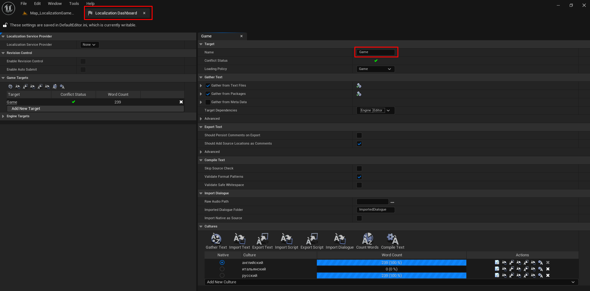

# Settings

First you need to register with [Google Cloud](https://cloud.google.com/translate), create a project in Google Cloud and get an API key.

Next, go to the project settings and specify the resulting API key:

1. Find in the plugins Localization Game
2. Enter your API key
3. Specify the default Culture so that it does not appear in the translation list.

.png>)


If you change the folder name in the LocalizationDashboard, then you will need to change the folder name in the plugin settings and restart the project.


<figure><figcaption></figcaption></figure>

<figure><figcaption></figcaption></figure>
